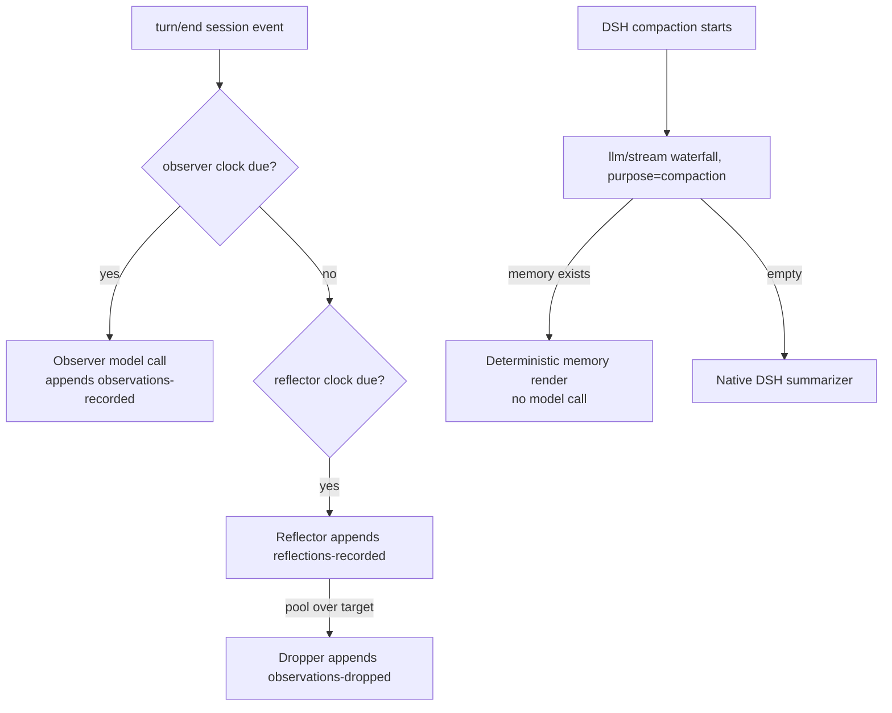

# DSH Observational Memory

[中文](README.md) | English

A plugin for [DeepSeek Harness](https://github.com/deepseek-ai/deepseek-harness) (DSH) that continuously distills session work into **observations** and **reflections** in the background, so long sessions stay coherent across many compactions. Ported from [pi-observational-memory](https://github.com/elpapi42/pi-observational-memory) (an extension for the Pi coding agent).

When DSH compacts, the summary is already prepared — no model has to rewrite the past on the spot: observer, reflector, and dropper run in the background on token cadences, and compaction itself becomes one deterministic render with zero model calls.

## Why

Long sessions eventually hit the context window. A compaction summarizes the session; the next compaction summarizes that summary. After enough cycles the agent carries a compressed copy of a compressed copy: the rationale behind decisions, rejected approaches, key constraints, and what the user already clarified start to disappear.

This plugin moves the memory work **earlier**, into the session itself, instead of patching things up when compaction arrives.

## Features

- **Background memory pipeline**: observer (distills session events into timestamped, relevance-rated observations) → reflector (extracts durable facts from observations) → dropper (prunes observations already covered by reflections), all driven by session events like `turn/end` against token thresholds.
- **Compaction as render**: when DSH's compaction engine makes its summarization call (`purpose: 'compaction'`), the plugin intercepts it in the `llm/stream` waterfall and answers with the rendered memory text — instant compaction, zero model calls; an empty projection delegates to the native summarizer.
- **Proactive compaction**: an idle session whose measured context reaches the threshold is compacted via `compactNow`; the threshold supports calibrated (static value) and ratio (context window × fraction) modes, and the settings card shows only the parameter the selected mode consumes.
- **The recall tool**: the model can recover the exact source evidence (timestamped original text) behind any memory id.
- **The Memory tab**: a new conversation view tab showing the memory inventory, worker progress, memory content (visible / full), and debug logs, rendered live by the host.
- **The rollback button**: every user message gains a rollback action that forks the session right before it and restores the text into the composer.
- **Bilingual settings card**: the Observational Memory card under Settings → Plugins → Plugin configuration speaks 中文/English, and the model override is picked from the models added to DSH via cascading provider → model → reasoning-effort dropdowns.

## Core concepts

- **Observation** — a timestamped, relevance-rated (`low`/`medium`/`high`/`critical`) record of something that happened, anchored to the session events that support it (`sourceEventSeqs`).
- **Reflection** — a durable fact distilled from observations (user preferences, project constraints, technical decisions, completed outcomes), citing its supporting observations (`supportingObservationIds`).
- **Drop** — the dropper prunes the active observation pool after a successful reflection. Dropping removes an observation from active memory only; the ledger history stays intact and recallable via the `recall` tool.

## How it works



1. The session proceeds normally; the consolidation pipeline (observer first, then reflector, then dropper) runs from `turn/end` and `agent/session-start` events.
2. Each worker has exactly one recording tool; code validates everything the model proposes (source seqs and support ids must exist), and ids are deterministic content hashes.
3. When DSH's compaction engine makes its summarization call (`purpose: 'compaction'`), the plugin intercepts it in the `llm/stream` waterfall: a non-empty projection is rendered into the summary directly — compaction is instant; an empty projection delegates to the native summarizer.
4. When the compaction commits, the visible memory is recorded in the ledger for visible-vs-full drift inspection.

Differences from the Pi version (platform adaptations):

- **Ledger storage**: DSH persistence only accepts its built-in session-event vocabulary (external plugins cannot append `ignorable` custom session events), so the ledger lives in plugin-owned files (default `$DSH_HOME/observational-memory/<sessionId>.jsonl`) — the session log and the harness itself are never touched.
- **Compaction integration**: Pi replaces the summary in `session_before_compact`; DSH has no such hook, so this plugin intercepts the summarization call in the `llm/stream` waterfall instead — same "compaction as render" effect.
- **Proactive compaction**: the threshold has two modes (matching the Pi version), see Configuration below; in the Web composition the compaction engine lives inside the agent preset's isolated realm, which the plugin crosses via `agentPresets.serviceFor`.
- **Command-surface counterparts**: the Pi version's `/om:status` and `/om:view` TUI commands live on as the conversation's **Memory** view tab (see Usage); clipboard copying is carried by the tab's copy button.
- **Rollback**: Add the **rollback** button under each user message (abort the run, rewind to just before the last prompt, restore it into the editor, see Usage).

## Install

Requires deepseek-harness **0.1.5-rc.2** (`@deepseek-ai/dsh-*` packages ≥ 0.1.5-rc.2).

Add the plugin to a profile through the DSH CLI (`web` shown here; substitute as needed). The package ships a `cordis.patch.yml`, so the composer mounts the host half automatically and serves `/plugins/dsh-observational-memory/client.js` to the Web client — no extra composition wiring.

### From npm

```sh
dsh plugin --profile web add dsh-observational-memory
```

### From GitHub

```sh
dsh plugin --profile web add github:EPCN-fla/dsh-observational-memory
```

For git-source installs, npm runs the package's `prepare` script to build automatically (requires Node `^22.19.0` or `>=24`).

### From tarball

```sh
git clone https://github.com/EPCN-fla/dsh-observational-memory.git
cd dsh-observational-memory
npm install
npm run build
npm pack        # produces dsh-observational-memory-<version>.tgz
dsh plugin --profile web add ./dsh-observational-memory-<version>.tgz
```

### Local development

During development you can also point the CLI at the working copy directly; rebuild with `npm run build` after each change:

```sh
dsh plugin --profile web add /absolute/path/to/dsh-observational-memory
```

Restart DSH Web afterwards. Verify the mount: `dsh --profile web --dump-config | grep observational-memory`.

## Usage

### The settings card

Open **Settings → Plugins → Plugin configuration** and expand the **Observational Memory** card at the very bottom; edits apply live on **Save** — no restart. The card is bilingual (中文/English) and follows the DSH language setting.

- **Thresholds**: the compaction-threshold mode decides which single threshold parameter is shown — `calibrated` shows the static threshold, `ratio` shows the window ratio. Only the shown parameter is effective; the hidden one is inert however it is set.
- **Model (optional)**: cascading provider → model ID → reasoning-effort dropdowns fed by the models added to DSH; a downstream dropdown stays empty until its upstream pick is made. Leave everything blank to let memory workers follow the session model.
- Every field can be reset to its default; invalid drafts disable Save and say why.

### The Memory tab

The conversation's view ring gains a **Memory** tab right of Chat and Trajectory, carrying the content of the Pi version's `/om:status` and `/om:view` commands. The host renders the reports on demand through the plugin's Typert Remote endpoints (`observationalMemory/status|view|run|logs`):

- **Status**: memory inventory (recorded / dropped / active / visible observations and reflections, drift counts), per-worker progress (tokens to the next observation / reflection / compaction, with the ratio-mode annotation), in-flight runs, and the latest worker errors.
- **Memory content**: the `/om:view` output, switchable between **Visible** (what the agent actually saw after the latest compaction) and **Full** (the whole ledger); a copy button writes the current content to the clipboard.
- **Debug log**: when `debugLog` is on, the tail of the session's NDJSON debug events (200 lines by default).

The toolbar's **Run now** button triggers one full consolidation pass (observer → reflector → dropper) on demand, bypassing the passive switch and the token clocks (an empty backlog still costs no model call); a run already in flight is never duplicated. This is the proactive entry passive mode keeps — available in active mode too.

The tab fetches once when opened and then only on the Refresh button — no polling.

### The recall tool

The agent can call `recall(id)` with a 12-character lowercase hex memory id to recover the exact source evidence (timestamped original text) behind an observation or reflection. It is an exact lookup, not search: the model cites ids it saw in compacted memory.

### The rollback button

Every user message (steering messages included) gains a **rollback** button left of its copy button: clicking it forks the session at the completed-turn boundary right before that message, opens the child session, and restores the message text into its composer — ready to edit and resend. The operation is non-destructive: the source session keeps its history on its own branch.

On its first memory touch the new branch **inherits** the source session's memory through the fork point (observations, reflections, drop records and visible memory), so a rollback never restarts memory from scratch; records covering only the abandoned branch (events past the fork point) stay behind. When the immediate parent's ledger is empty, the walk continues up the fork lineage to the nearest usable ledger, so chained rollbacks still inherit. Passive mode does not affect inheritance.

DSH can only cut sessions at turn boundaries, so the button stays disabled (with an explanatory tooltip) for first-turn messages (no earlier boundary to roll back to), messages with attachments (a draft cannot restore uploads), and textless messages. Unloading the plugin restores the built-in user message rendering.

## Configuration

Configuration lives in its own `observational-memory` namespace of the DSH user settings document (default `$DSH_HOME/settings.yaml`) — never in the harness's own composition. Two ways to edit:

1. **UI**: see "The settings card" above.
2. **File**: edit the `observational-memory:` section of `$DSH_HOME/settings.yaml` by hand.

### Settings

| Setting | Default | Meaning |
| --- | --- | --- |
| `observeAfterTokens` | `10000` | Estimated new source tokens that trigger an observer run |
| `reflectAfterTokens` | `20000` | Estimated new source tokens that trigger a reflector run |
| `observerChunkMaxTokens` | derived | Max source text serialized into one observer call; blank derives 20% of the memory model's context window (min 256, fallback 60,000) |
| `compactAfterTokens` | `0` | Proactive idle-compaction threshold; effective only in calibrated mode, where `0` disables it and lets DSH's native policy drive |
| `compactAfterTokensMode` | `calibrated` | Threshold interpretation: `calibrated` uses the static value; `ratio` derives session model context window × ratio. The settings card shows only the parameter the selected mode consumes — the other is inert however it is set |
| `compactAfterTokensRatio` | `0.68` | Window fraction effective only in ratio mode, open interval (0, 1); when the window or ratio is unusable the trigger stays disabled (no fallback to `compactAfterTokens`) |
| `observationsPoolMaxTokens` | `20000` | Observation-token budget for compaction full-fold pressure |
| `observationsPoolTargetTokens` | half of max | Active observation pool target maintained by the dropper |
| `agentMaxTurns` | `16` | Tool-call turn cap for one background worker run |
| `model` | session model | Worker model override: `{ provider, id, reasoningEffort? }`; in the settings card, picked from the models added to DSH via cascading provider → model → reasoning-effort dropdowns |
| `modelFallbackAfterFailures` | `0` | After this many consecutive memory-worker failures, suspend the model override and fall back to the session model; `0` means never. Applies only when a `model` override is configured; the count restarts on an override-path success, a config change, or a session reload |
| `showWorkerNotifications` | `true` | Log worker progress to the host log (warnings and errors always log) |
| `passive` | `false` | Passive mode: disable all proactive background triggers (the Memory tab's **Run now**, manual/DSH compaction and recall stay available) |
| `debugLog` | `false` | Write per-session NDJSON debug events under the storage directory |
| `storageDir` | `$DSH_HOME/observational-memory` | Ledger storage root |

### Storage format

An example user-layer document of the `observational-memory` namespace:

```yaml
observational-memory:
  observeAfterTokens: 10000
  reflectAfterTokens: 20000
  compactAfterTokensMode: ratio
  compactAfterTokensRatio: 0.6
  model:
    provider: my-provider
    id: my-model
    reasoningEffort: high
  debugLog: false
```

Deployments can also preset composition-layer values through the plugin's cordis row `config:` (serving as the base under the user layer).

## Scope and known limitations

- **Subagents**: subagent sessions (`origin: 'subagent'`) are neither observed nor proactively compacted.
- **Preset differences**: in the Web composition the compaction engine lives inside the agent preset's isolated realm; presets without compaction (e.g. `minimal`) quietly skip the proactive trigger (the ledger and compaction render are unaffected).
- **Ratio mode's window dependency**: when the session model's context window is unresolvable in ratio mode, the proactive trigger stays disabled instead of falling back to the static threshold.
- **Headless runs**: the Memory tab is fed by Typert Remote endpoints; without an API Gateway (headless runs) the tab is unavailable, while everything else (ledger, compaction render, proactive trigger, recall tool) keeps working.
- **Rollback implementation**: the button replaces the `user`/`steering` renderers of the `conversation.chat.node` slot (priority -1 shadows the built-ins). If another plugin shadows the same keys, the registration clash affects only those renderers, not the rest of this plugin.
- **Token estimates**: all token counts are estimates (~4 chars/token) and can drift on non-ASCII content.
- **Ledger cleanup**: ledger files live in the plugin directory (default `$DSH_HOME/observational-memory`); uninstalling the plugin does not remove them — delete them manually if unwanted.

## Development

Requires Node `^22.19.0` or `>=24`.

```sh
npm install         # install dependencies
npm run typecheck   # tsc --noEmit
npm test            # vitest (tests/ directory)
npm run build       # builds lib/index.js (host ESM) + lib/client.js (browser lazy-CJS)
```

All tests live in `tests/`:

| File | Coverage |
|---|---|
| `tests/config.test.ts` | schema defaults, ratio-mode threshold resolution, derived budgets |
| `tests/card-controller.test.ts` | card staging/saving, hidden parameter never written, model cascade, catalog parsing |
| `tests/card-render.test.tsx` | static card rendering, zh/en locale key parity |
| `tests/card-dom.test.tsx` | real DOM: mode-switched threshold display, cascading model dropdowns |
| `tests/ledger-*.test.ts` | ledger fold, projections, progress, render, recall, persistence |
| `tests/observer/reflector/dropper/worker-loop*.test.ts` | observer / reflector / dropper worker loops |
| `tests/compaction-*.test.ts`, `tests/consolidation.test.ts` | compaction interception, consolidation trigger |
| `tests/report.test.ts` | `/om:status` and `/om:view` report text |
| `tests/recall-tool.test.ts` | recall tool registration and evidence recovery |
| `tests/memory-controller.test.ts`, `tests/memory-view.test.tsx` | Memory tab controller and view |
| `tests/rollback.test.ts`, `tests/user-message*.test.tsx` | rollback gating and interaction |
| `tests/inheritance.test.ts` | ledger inheritance after fork/rollback (boundary filtering, lineage walk, passive mode) |
| `tests/serialize.test.ts` | source-event serialization and token estimation |

### Local integration

`cordis.dev.yml.example` is a dev patch example (mounts the local build by absolute path). Copy it to `cordis.dev.yml` (gitignored) and replace the `/absolute/path/to` placeholders with this checkout's location:

```sh
# Copy a profile into an isolated DSH_HOME so your daily setup stays untouched
DSH_HOME=/path/to/dev-home dsh --profile web --patch $PWD/cordis.dev.yml --no-open --port 3099
```

The `.dev/` directory ships a fake LLM adapter (`.dev/fake-llm.mjs`) and an end-to-end driver (`.dev/e2e.sh`) that exercise observe → reflect → compaction-render without a real provider.

### Layout

```
src/
  index.ts            plugin entry (Config schema, settings namespace, trigger/tool wiring)
  config.ts           config schema and derived budgets (incl. ratio-mode threshold resolution)
  runtime.ts          shared runtime (live config, model resolution, in-flight guards, errors)
  api.ts              Typert Remote service (observationalMemory/status|view|run|logs for the Memory tab)
  report.ts           /om:status and /om:view report text builders (pure functions)
  ledger/             memory ledger core (types/fold/projection/progress/render/recall/store)
  workers/            observer/reflector/dropper (loop + prompts + coverage + pool)
  hooks/              consolidation (turn/end), compaction (llm/stream), proactive (idle)
  tools/recall.ts     recall tool
  client/             settings card, Memory tab, rollback-enabled user message renderer
tests/                vitest suite
```

## Credits

Semantics and inspiration: [elpapi42/pi-observational-memory](https://github.com/elpapi42/pi-observational-memory), itself inspired by [Mastra's Observational Memory](https://mastra.ai/blog/observational-memory) research. This repository is an independent implementation for the DSH plugin system.

## License

[MIT](LICENSE)
