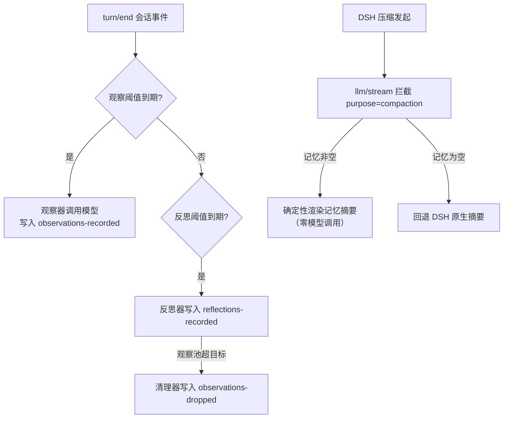

# DSH Observational Memory

中文 | [English](README.en.md)

适用于 [DeepSeek Harness](https://github.com/deepseek-ai/deepseek-harness)（DSH）的插件：在后台持续把会话工作沉淀为**观察（Observations）**与**反思（Reflections）**，让长会话经过多轮压缩依然连贯。移植自 [pi-observational-memory](https://github.com/elpapi42/pi-observational-memory)（Pi 的扩展）。

当 DSH 发生上下文压缩时，压缩摘要有现成的记忆可用——不再需要模型现场重写历史：观察器、反思器、清理器在后台按 token 节奏运行，压缩真正发生时只需一次确定性的渲染，零模型调用。

## 为什么需要

长会话最终都会撞上上下文墙。压缩把会话总结成摘要，多轮压缩之后，代理携带的已经是"摘要的摘要"——设计决策的理由、被否决过的方案、关键约束、用户已澄清过的内容开始悄悄丢失。

本插件把记忆工作**前置**到会话进行过程中，而不是等压缩发生时再补救。

## 特性

- **后台记忆流水线**：观察器（把会话事件蒸馏为带时间戳、带相关度的观察）→ 反思器（从观察中提炼长期事实）→ 清理器（修剪已被反思覆盖的观察），全部由 `turn/end` 等会话事件按 token 阈值驱动。
- **压缩即渲染**：DSH 压缩引擎发起摘要调用时（`purpose: 'compaction'`），插件在 `llm/stream` 瀑布中拦截，直接用渲染好的记忆文本应答——压缩零等待、零模型调用；记忆为空时回退 DSH 原生摘要。
- **主动压缩**：会话空闲且上下文达到阈值时主动触发压缩；阈值支持 calibrated（固定值）与 ratio（上下文窗口 × 比例）两种模式，设置卡片只显示当前模式生效的那个参数。
- **recall 工具**：模型可凭记忆 id 精确恢复任意观察/反思背后的原始会话证据（带时间戳的原文）。
- **记忆选项卡**：对话视图环新增「记忆」页，实时展示记忆清单、worker 进度、记忆内容（可见/完整）与调试日志。
- **回退按钮**：每条用户消息下新增「回退」，一键在消息前分叉会话并把原文放回输入框。
- **双语设置卡片**：「设置 → 插件 → 插件配置」中的 Observational Memory 卡片支持中/英文，模型覆盖从 DSH 已添加的模型列表按 提供商 → 模型 → 推理强度 级联选择。

## 核心概念

- **观察（Observation）**：带时间戳、带相关度（low/medium/high/critical）的会话事件记录，每条都锚定到产生它的会话事件（`sourceEventSeqs`）。
- **反思（Reflection）**：从观察中蒸馏出的长期事实（用户偏好、项目约束、技术决策、已完成的结果），每条都引用支撑它的观察（`supportingObservationIds`）。
- **清理（Drop）**：清理器在反思成功后修剪活跃观察池，删除内容已被反思覆盖的观察。删除只是从活跃记忆中移除，账本历史仍然保留、仍可被 `recall` 工具追溯。

## 工作原理



1. 会话正常推进；`turn/end` 与 `agent/session-start` 事件驱动整合流水线（观察器优先，随后反思器，最后清理器）。
2. 每个 worker 只有一个记录工具，由代码校验模型产出（来源 seq、支撑 id 必须真实存在），id 由内容哈希确定性生成。
3. DSH 压缩引擎做摘要调用时（`purpose: 'compaction'`），本插件在 `llm/stream` 瀑布中拦截：投影非空则直接返回渲染好的记忆文本，压缩零等待；投影为空则放行原生摘要。
4. 压缩提交后，可见记忆（visible memory）记入账本，供状态对比（drift）使用。

与 pi 版的差异（平台适配）：

- **账本存储**：DSH 的持久化只接受其内置事件词表（外部插件无法写入带 `ignorable` 标记的自定义会话事件），因此账本存放在插件自己的目录（默认 `$DSH_HOME/observational-memory/<sessionId>.jsonl`），不动会话日志，不影响 DSH 本体。
- **压缩集成**：pi 用 `session_before_compact` 钩子替换摘要；DSH 没有这个钩子，本插件通过 `llm/stream` 瀑布拦截压缩摘要调用来实现同样的"压缩即渲染"。
- **主动压缩**：阈值有两种模式（与 pi 版一致），见下文「配置」；在 Web 组合中压缩引擎位于 agent preset 的隔离 realm 内，本插件经 `agentPresets.serviceFor` 跨 realm 解析。
- **命令行界面的对应形态**：pi 版的 `/om:status`、`/om:view` TUI 命令在 DSH 中由对话上方的**记忆**选项卡承载（见下文「使用」）；pi 版的剪贴板复制由选项卡内的复制按钮承载。
- **回退**：新增用户消息下的**回退**按钮（中止当前运行、回退到最近一条用户输入之前、把原文放回输入框，详见下文「使用」）。

## 安装

要求：deepseek-harness **0.1.5-rc.2**（`@deepseek-ai/dsh-*` 包 ≥ 0.1.5-rc.2）。

通过 DSH CLI 把插件加入指定的 Profile（这里以 `web` 为例，按需替换）。本包自带 `cordis.patch.yml`，组合器会自动挂载 host 半端，并向 Web 客户端提供 `/plugins/dsh-observational-memory/client.js`——安装后无需额外的组合配置。

### From npm

```sh
dsh plugin --profile web add dsh-observational-memory
```

### From GitHub

```sh
dsh plugin --profile web add github:EPCN-fla/dsh-observational-memory
```

通过 git 源安装时，npm 会执行包的 `prepare` 脚本自动完成构建（要求 Node `^22.19.0` 或 `>=24`）。

### From tarball

```sh
git clone https://github.com/EPCN-fla/dsh-observational-memory.git
cd dsh-observational-memory
npm install
npm run build
npm pack        # 产出 dsh-observational-memory-<version>.tgz
dsh plugin --profile web add ./dsh-observational-memory-<version>.tgz
```

### Local development

开发期也可以把 CLI 直接指向工作副本目录；每次改动后重新 `npm run build` 即可生效：

```sh
dsh plugin --profile web add /absolute/path/to/dsh-observational-memory
```

安装后重启 DSH Web。确认加载：`dsh --profile web --dump-config | grep observational-memory`。

## 使用

### 设置卡片

打开 **设置 → 插件 → 插件配置**，最底部的 **Observational Memory** 卡片，点击展开后编辑，**保存**即时生效（无需重启）。卡片支持中/英双语，跟随 DSH 的语言设置。

- **阈值区**：「压缩阈值模式」决定只显示哪个阈值参数——`calibrated` 显示「主动压缩阈值」，`ratio` 显示「压缩阈值比例」；只有显示的参数有效，隐藏的参数无论设成多少都不生效。
- **模型（可选）区**：「提供商 → 模型 ID → 推理强度」三级下拉，选项来自 DSH 已添加的模型列表；前者未选择时后者的下拉框为空。全部留空则记忆 worker 跟随会话当前模型。
- 每个字段可「重置为默认」；保存即时生效，校验不通过时保存按钮不可用并提示原因。

### 记忆选项卡

对话上方的视图环在「对话」「轨迹」右侧新增**记忆**选项卡，对应 pi 版的 `/om:status` 与 `/om:view` 命令，内容经插件注册的 Typert Remote 端点（`observationalMemory/status|view|logs`）由宿主实时生成：

- **状态**：记忆清单（已记录/已清理/活跃/可见 观察数与反思数、漂移统计）、各 worker 的进度条（距下次观察/反思/压缩的 token 进度，含 ratio 模式标注）、在途任务与最近的 worker 错误。
- **记忆内容**：`/om:view` 的内容，可在「当前可见」（最近一次压缩后代理实际可见的记忆）与「完整记录」（账本全量）之间切换；复制按钮把当前内容写入剪贴板。
- **调试日志**：`debugLog` 开启时显示该会话 NDJSON 调试事件的尾部（默认 200 行）。

选项卡在打开时拉取一次，之后用「刷新」按钮更新；不会轮询。

### recall 工具

代理可调用 `recall(id)`（12 位小写十六进制记忆 id）恢复某条观察/反思背后的**原始会话证据**（带时间戳的原文）。它是精确定位工具，不是搜索工具：模型在压缩后的记忆行里看到 id，需要确证时再调用。

### 回退按钮

每条用户消息（含 steering 消息）下方、「复制」左侧新增**回退**按钮：点击后在**该消息之前**的最近已完成轮次边界处分叉出一个新会话（fork），打开新会话，并把该消息的原文放回其输入框——可以修改后重新发送。整个过程非破坏性：原会话历史原样保留在自己的分支上。

DSH 只能按轮次边界切分会话，因此按钮在以下情况保持禁用（悬停有提示）：首轮消息（之前没有可回退的边界）、纯附件或含附件的消息（草稿无法还原附件）、无文本消息。卸载本插件后，用户消息渲染恢复原样。

## 配置

配置位于 DSH 用户设置文档的独立命名空间 `observational-memory`（默认 `$DSH_HOME/settings.yaml`），与 DSH 本体配置完全隔离。两种改法：

1. **界面**：见上文「设置卡片」。
2. **手改文件**：编辑 `$DSH_HOME/settings.yaml` 的 `observational-memory:` 段。

### 配置项

| 配置 | 默认 | 含义 |
| --- | --- | --- |
| `observeAfterTokens` | `10000` | 观察器触发所需的增量源文本 token 数（估算） |
| `reflectAfterTokens` | `20000` | 反思器触发所需的增量源文本 token 数 |
| `observerChunkMaxTokens` | 推导 | 单次观察器调用序列化的源文本上限；留空按记忆模型上下文窗口的 20% 推导（下限 256，未知窗口回落 60000） |
| `compactAfterTokens` | `0` | 主动压缩阈值（会话空闲且上下文达到该值时触发）；仅 calibrated 模式生效，`0` 关闭，交给 DSH 原生策略 |
| `compactAfterTokensMode` | `calibrated` | 阈值解释方式：`calibrated` 用固定值；`ratio` 按会话模型上下文窗口 × 比例推导。设置卡片只显示当前模式生效的那个参数，另一个无论设成多少都无效 |
| `compactAfterTokensRatio` | `0.68` | 仅 ratio 模式生效的窗口比例，取 (0, 1) 开区间；窗口或比例无效时触发器保持关闭（不回退到 `compactAfterTokens`） |
| `observationsPoolMaxTokens` | `20000` | 压缩全量折叠的观察池预算 |
| `observationsPoolTargetTokens` | 上限的一半 | 清理器维护的活跃观察池目标 |
| `agentMaxTurns` | `16` | 后台 worker 单次运行的工具调用轮数上限 |
| `model` | 会话模型 | 记忆 worker 的模型覆盖：`{ provider, id, reasoningEffort? }`；设置卡片中从 DSH 已添加的模型列表按 提供商 → 模型 → 推理强度 逐级下拉选择 |
| `modelFallbackAfterFailures` | `0` | 记忆 worker 连续失败这么多次后，挂起模型覆盖并回退到会话模型；`0` 表示永不回退。仅在配置了 `model` 覆盖时生效；override 路径成功、修改配置或会话重载后重新计数 |
| `showWorkerNotifications` | `true` | 在主机日志记录 worker 进度（警告与错误始终记录） |
| `passive` | `false` | 被动模式：关闭全部主动后台触发 |
| `debugLog` | `false` | 在存储目录下写每个会话的 NDJSON 调试事件 |
| `storageDir` | `$DSH_HOME/observational-memory` | 账本存储根目录 |

### 配置存储格式

`observational-memory` 命名空间的用户层文档示例：

```yaml
observational-memory:
  observeAfterTokens: 10000
  reflectAfterTokens: 20000
  compactAfterTokensMode: ratio
  compactAfterTokensRatio: 0.6
  model:
    provider: my-provider
    id: my-model
    reasoningEffort: high
  debugLog: false
```

部署方也可以通过插件的 cordis 行 `config:` 预置组合层配置（作为用户层的 base）。

## 支持范围与已知限制

- **子代理**：子代理（subagent）会话不参与记忆与主动压缩（`origin: 'subagent'` 会被跳过）。
- **Preset 差异**：在 Web 组合中压缩引擎位于 agent preset 的隔离 realm 内；`minimal` 等不含压缩引擎的 preset 下，主动压缩触发器自动静默（记忆账本与压缩渲染不受影响）。
- **ratio 模式的窗口依赖**：ratio 模式下会话模型的上下文窗口不可解析时，主动压缩触发器保持关闭，不回退到固定阈值。
- **Headless 运行**：记忆选项卡的数据走 Typert Remote 端点；无 API Gateway 的 headless 运行中选项卡不可用，其余功能（账本、压缩渲染、主动压缩、recall 工具）不受影响。
- **回退按钮的实现**：通过替换 `conversation.chat.node` 槽位的 `user`/`steering` 渲染器实现（priority -1 遮蔽内置渲染器）。若其他插件也遮蔽同一键，注册冲突只会影响对应渲染器，不影响本插件的其他功能。
- **Token 估算**：所有 token 计数为估算值（约 4 字符/token），非 ASCII 内容可能偏差。
- **账本清理**：账本文件存放于插件目录（默认 `$DSH_HOME/observational-memory`），卸载插件不会自动清理，可手动删除。

## 开发

要求 Node `^22.19.0` 或 `>=24`。

```sh
npm install         # 安装依赖
npm run typecheck   # tsc --noEmit
npm test            # vitest（tests/ 目录）
npm run build       # 构建 lib/index.js（宿主 ESM）+ lib/client.js（浏览器 lazy-CJS）
```

测试全部位于 `tests/`：

| 文件 | 覆盖 |
|---|---|
| `tests/config.test.ts` | 配置 schema 默认值、ratio 模式阈值解析、派生预算 |
| `tests/card-controller.test.ts` | 设置卡片暂存/保存、隐藏参数不写入、模型级联、目录解析 |
| `tests/card-render.test.tsx` | 卡片静态渲染、中英文案键位对齐 |
| `tests/card-dom.test.tsx` | 真实 DOM：阈值随模式切换显示、模型三级下拉级联 |
| `tests/ledger-*.test.ts` | 账本折叠、投影、进度、渲染、recall、持久化 |
| `tests/observer/reflector/dropper/worker-loop*.test.ts` | 观察器/反思器/清理器 worker 循环 |
| `tests/compaction-*.test.ts`、`tests/consolidation.test.ts` | 压缩拦截、整合触发器 |
| `tests/report.test.ts` | `/om:status`、`/om:view` 报告文本 |
| `tests/recall-tool.test.ts` | recall 工具注册与证据恢复 |
| `tests/memory-controller.test.ts`、`tests/memory-view.test.tsx` | 记忆选项卡控制器与视图 |
| `tests/rollback.test.ts`、`tests/user-message*.test.tsx` | 回退按钮门控与交互 |
| `tests/serialize.test.ts` | 源事件序列化与 token 估算 |

### 本地联调

`cordis.dev.yml.example` 是一个开发用 patch 示例（绝对路径挂载本地构建产物）。复制为 `cordis.dev.yml`（已 gitignore）并把 `/absolute/path/to` 占位替换为本仓库位置：

```sh
# 复制一个 profile 到独立 DSH_HOME，避免动日常环境
DSH_HOME=/path/to/dev-home dsh --profile web --patch $PWD/cordis.dev.yml --no-open --port 3099
```

`.dev/` 目录内含一个 fake LLM 适配器（`.dev/fake-llm.mjs`）与端到端驱动脚本（`.dev/e2e.sh`），可无真实模型跑通 观察→反思→压缩渲染 全链路。

### 目录结构

```
src/
  index.ts            插件入口（Config schema、settings 命名空间、各触发器与工具注册）
  config.ts           配置 schema 与派生预算（含 ratio 模式阈值解析）
  runtime.ts          共享运行时（配置热更新、模型解析、在途保护、错误记忆）
  api.ts              Typert Remote 服务（observationalMemory/status|view|logs，供记忆选项卡）
  report.ts           /om:status、/om:view 报告文本构建（纯函数）
  ledger/             记忆账本核心（types/fold/projection/progress/render/recall/store）
  workers/            观察器/反思器/清理器（loop + prompts + coverage + pool）
  hooks/              consolidation（turn/end 驱动）、compaction（llm/stream 拦截）、proactive（空闲压缩）
  tools/recall.ts     recall 工具
  client/             设置卡片、记忆选项卡、带回退按钮的用户消息渲染（中英文案、控制器、组件）
tests/                vitest 测试
```

## 致谢

灵感与语义来自 [elpapi42/pi-observational-memory](https://github.com/elpapi42/pi-observational-memory) 及其上游 [Mastra 的 Observational Memory 研究](https://mastra.ai/blog/observational-memory)。本仓库是面向 DSH 插件体系的独立实现。

## 许可证

[MIT](LICENSE)
